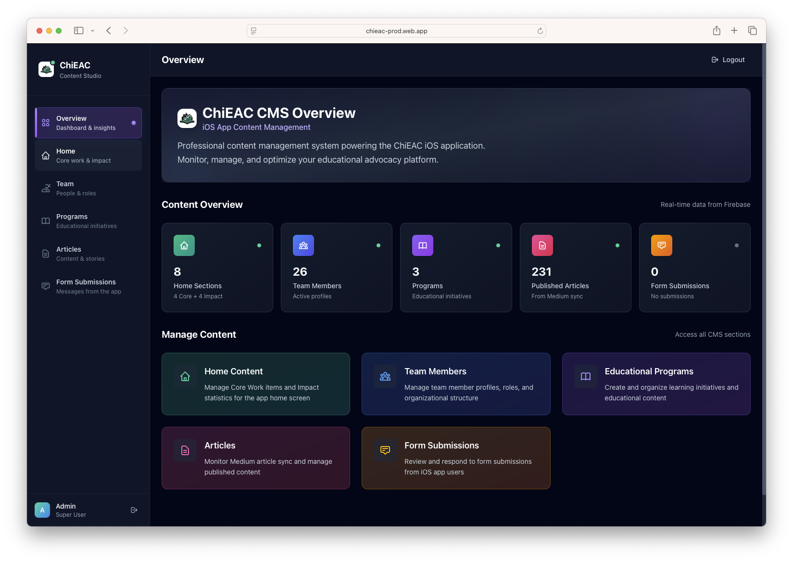
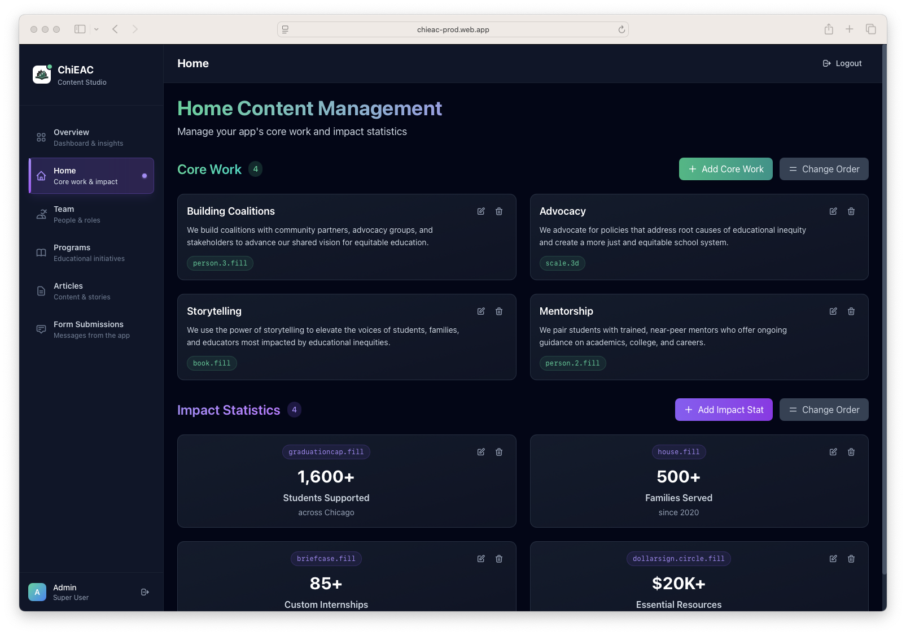
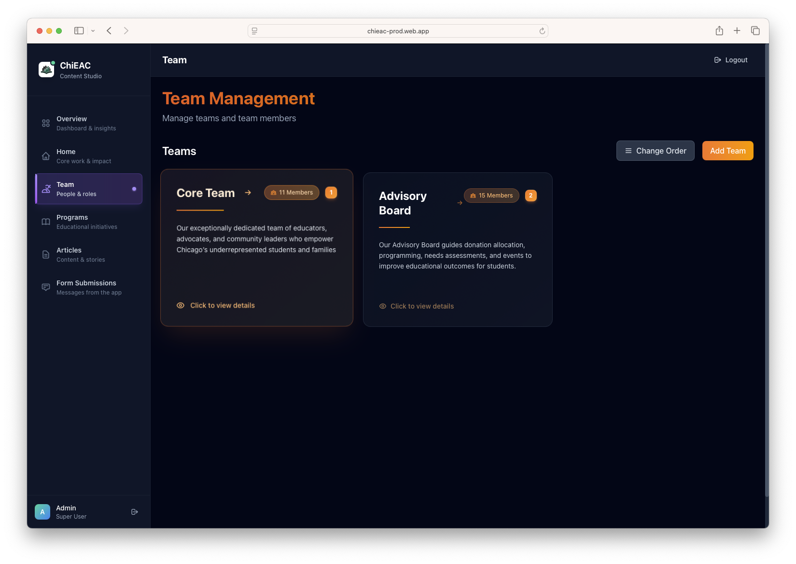
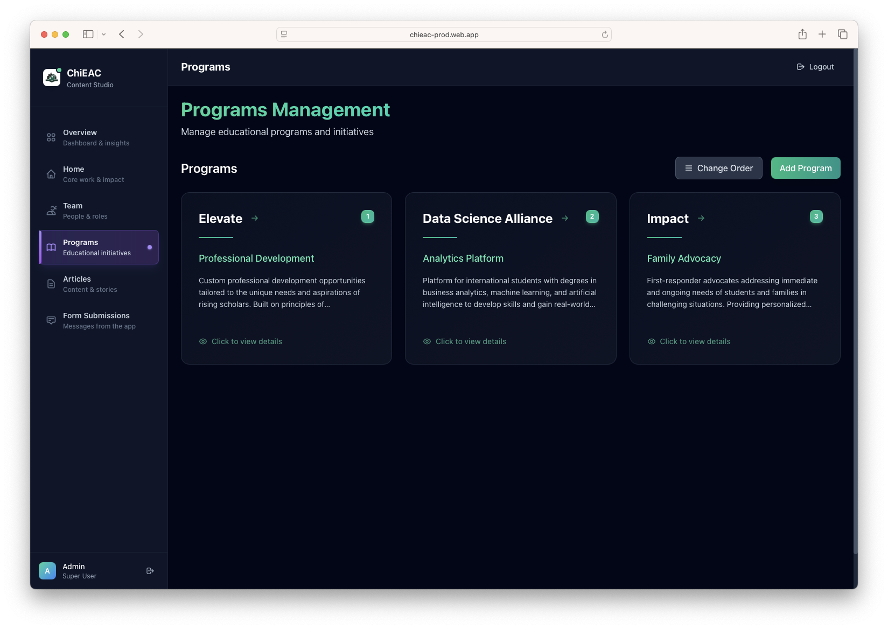
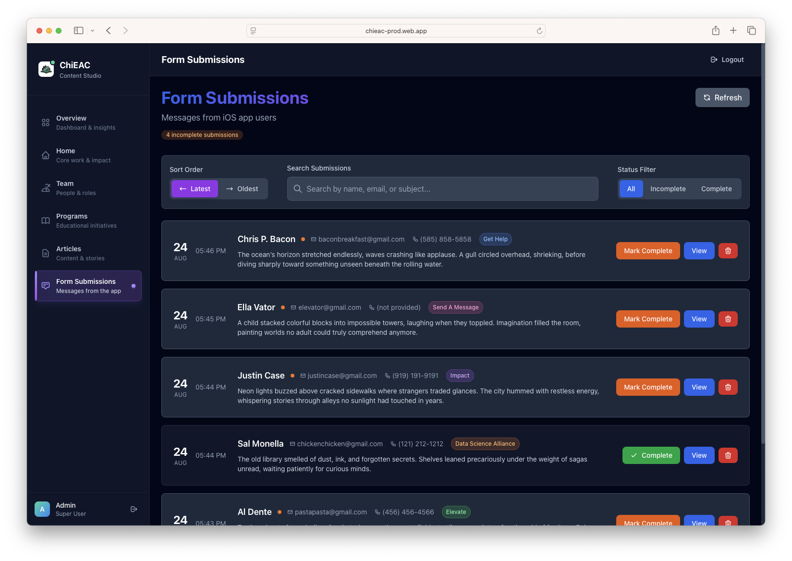

# ChiEAC CMS - Content Management System

[](https://reactjs.org/)
[](https://www.typescriptlang.org/)
[](https://vitejs.dev/)
[](https://firebase.google.com/)
[](https://tailwindcss.com/)

## 🚀 **[Live Application](https://chieac-prod.web.app/)**

> **Experience the CMS in action:** [https://chieac-prod.web.app/](https://chieac-prod.web.app/)

A modern, professional React-based content management system built with TypeScript, Firebase, and Tailwind CSS. Features complete team management, automated article ingestion from Medium, comprehensive programs management, home content management with Core Work and Impact sections, form submission handling with email notifications, and comprehensive Firebase Functions backend.

## 🎯 What's Been Built

This CMS currently provides **five fully implemented and production-ready modules**:

### ✅ **Home Management**
- Unified Core Work and Impact sections management
- Independent reordering with drag-and-drop functionality
- SF Symbol integration with suggestion pills
- Complete CRUD operations for both sections
- Conditional layout switching (grid ↔ vertical for reordering)
- Themed UI design (emerald for Core Work, violet for Impact)

### ✅ **Form Submissions Management**
- Complete form data collection and management system
- Real-time Firebase Firestore integration
- Professional email notifications via Gmail API
- Automated triggers for immediate notification delivery

### ✅ **Articles Management** 
- Automated Medium RSS feed ingestion (hourly)
- Manual article fetching with smart auto-refresh
- Complete CRUD operations with pagination
- Tag management and article organization
- Direct integration with Firebase Functions backend

### ✅ **Team Management**
- Full team and member CRUD operations
- Drag-and-drop reordering functionality
- Expert mode for advanced Firestore field editing
- Comprehensive confirmation workflows
- Real-time database synchronization

### ✅ **Programs Management**
- Complete educational programs CRUD operations
- Modular component architecture with dedicated dialogs
- SF Symbol icon integration with validation warnings
- Drag-and-drop reordering with conditional layouts
- Card-based UI with emerald/teal theme design

### 🚀 **Firebase Functions Backend**
- Professional serverless architecture on Firebase Functions v2
- Automated article processing and synchronization
- Gmail OAuth 2.0 integration for email notifications
- Comprehensive error handling and monitoring
- **[Complete Documentation →](./firebase-functions/README.md)**

---

## 📸 Application Screenshots

<div align="center">

<table>
<tr>
<td width="50%">

</td>
<td width="50%">

</td>
</tr>
<tr>
<td width="50%">

</td>
<td width="50%">

</td>
</tr>
<tr>
<td width="50%">

</td>
<td width="50%">

</td>
</tr>
</table>

</div>

---

## 🏗️ Architecture Overview

### Technology Stack
- **Frontend**: React 19.1.1 with TypeScript 5.8.3, Vite 7.1.2 build system
- **Backend**: Firebase Firestore, Authentication, and Cloud Functions
- **Serverless Functions**: Firebase Functions v2 with Node.js 22 runtime
- **Styling**: Tailwind CSS v4.1.12 with custom ChiEAC design system
- **State Management**: Custom React hooks with type-safe patterns
- **Email Service**: Gmail API with OAuth 2.0 authentication
- **Drag & Drop**: @hello-pangea/dnd for reordering functionality

### Core Architecture Principles
- **Modular Design**: Each feature is a self-contained module
- **Type Safety**: Full TypeScript coverage with strict type checking
- **Real-time Updates**: Smart auto-refresh without full page reloads
- **Professional UX**: Confirmation dialogs and loading states throughout
- **Serverless Backend**: Scalable Firebase Functions for all server operations

---

## 📦 Installation & Setup

### Prerequisites
- Node.js 18+ with npm
- Firebase project with Firestore and Authentication enabled
- Gmail account for email notifications (optional)

### 1. Clone and Install
```bash
git clone [repository-url]
cd cms-chieac
npm install
```

### 2. Firebase Configuration
Create `.env` file with your Firebase project configuration:
```env
VITE_FIREBASE_API_KEY=your_api_key
VITE_FIREBASE_AUTH_DOMAIN=your_project.firebaseapp.com
VITE_FIREBASE_PROJECT_ID=your_project_id
VITE_FIREBASE_STORAGE_BUCKET=your_project.appspot.com
VITE_FIREBASE_MESSAGING_SENDER_ID=your_sender_id
VITE_FIREBASE_APP_ID=your_app_id
VITE_FIREBASE_MEASUREMENT_ID=your_measurement_id
```

### 3. Initialize Firestore Collections
The system requires these collections:
- `teams` - Team management data
- `team_members` - Team member information
- `articles` - Medium articles and metadata
- `programs` - Educational programs with benefits and impact data
- `contact_form_submissions` - Contact form submissions from iOS app
- `core_work` - Core work items with titles and descriptions
- `impact_stats` - Impact statistics with numbers and labels

### 4. Deploy Firebase Functions (Optional)
For full functionality including automated article ingestion and email notifications:
```bash
cd firebase-functions
npm install
NODE_OPTIONS="--no-deprecation" firebase deploy --only functions
```
**[See complete Firebase Functions setup →](./firebase-functions/README.md)**

### 5. Start Development
```bash
npm run dev
```

---

## 🚀 Development Commands

```bash
npm run dev          # Start development server with hot reload
npm run build        # Production build with TypeScript compilation
npm run preview      # Preview production build locally
npm run lint         # ESLint code analysis with React rules
```

---

## 📁 Project Structure

```
src/
├── components/
│   ├── Layout.tsx                    # Main application layout with navigation
│   ├── HomeManager/                  # 🟢 COMPLETE: Home content management
│   │   ├── HomeManager.tsx          # Main component with both sections
│   │   ├── components/              # 9 UI components (cards, forms, dialogs, sections)
│   │   ├── hooks/                   # useHomeManager hook for state management
│   │   ├── types.ts                 # TypeScript definitions
│   │   └── index.ts                 # Module exports
│   ├── TeamManager/                  # 🟢 COMPLETE: Team & member management
│   │   ├── TeamManager.tsx          # Main component with routing
│   │   ├── components/              # UI components (13 components)
│   │   ├── hooks/                   # State management hooks
│   │   ├── types.ts                 # TypeScript definitions
│   │   └── index.ts                 # Module exports
│   ├── ArticlesManager/             # 🟢 COMPLETE: Article management
│   │   ├── components/              # UI components with pagination
│   │   ├── hooks/                   # Article fetching and management
│   │   └── index.ts                 # Module exports
│   ├── ProgramsManager/             # 🟢 COMPLETE: Programs management
│   │   ├── ProgramsManager.tsx      # Main component
│   │   ├── components/              # UI components (4 components)
│   │   ├── types.ts                 # TypeScript definitions
│   │   └── index.ts                 # Module exports
│   └── FormSubmissionsManager/      # 🟢 COMPLETE: Form submissions management
│       ├── components/              # UI components with pagination
│       ├── hooks/                   # Submission fetching and management
│       └── index.ts                 # Module exports
├── pages/
│   ├── HomeManager.tsx              # 🟢 Home management page
│   ├── TeamManager.tsx              # 🟢 Team management page
│   ├── ArticlesManager.tsx          # 🟢 Articles management page
│   ├── ProgramsManager.tsx          # 🟢 Programs management page
│   ├── FormSubmissionsManager.tsx   # 🟢 Form submissions management page
│   ├── Dashboard.tsx                # 🟢 Main dashboard
│   └── LoginPage.tsx                # 🟢 Authentication
├── config/
│   └── firebase.ts                  # 🟢 Firebase configuration
├── types/
│   └── index.ts                     # 🟢 Global TypeScript definitions
└── utils/
    └── mediumIngestService.ts       # 🟢 Article ingestion utilities

firebase-functions/                   # 🟢 COMPLETE: Serverless backend
├── functions/src/
│   ├── articleManager/              # Medium RSS processing
│   ├── emailNotifications/          # Gmail API integration
│   ├── shared/                      # Common utilities
│   └── index.ts                     # Function exports
├── README.md                        # Complete backend documentation
├── README_Articles.md               # Article system documentation
└── README_Email.md                  # Email system documentation
```

**Legend:**
- 🟢 **Complete & Production Ready**

---

## 🎯 Core Features

### Home Management System
- **Unified Interface**: Single component managing both Core Work and Impact sections
- **Independent Reordering**: Separate drag-and-drop modes for each section
- **SF Symbol Integration**: Icon suggestions with themed pills (8 per form)
- **Conditional Layouts**: Grid layout switches to vertical stack during reordering
- **Document ID Patterns**: Meaningful IDs (core_work.{title}, impact.{label})
- **Real-time Sync**: Immediate database updates with order persistence

### Form Submissions System
- **Real-time Collection**: Firestore integration for form data storage
- **Email Notifications**: Automated Gmail notifications via Firebase Functions
- **Professional Templates**: HTML email templates with ChiEAC branding
- **OAuth Security**: Gmail API with secure refresh token management

### Articles Management System
- **Medium Integration**: Automated hourly RSS feed processing
- **Smart Auto-Refresh**: Real-time updates without page reloads
- **Manual Fetch**: On-demand article fetching with visual feedback
- **Tag Management**: Dynamic article tagging and organization
- **Pagination**: Professional pagination with configurable page sizes

### Team Management System
- **Drag & Drop**: Intuitive reordering for teams and members
- **Expert Mode**: Advanced Firestore field editing with safety warnings
- **Confirmation Workflows**: Professional UX with confirmation dialogs
- **Real-time Sync**: Immediate database updates with optimistic UI

### Programs Management System
- **Complete CRUD**: Add, edit, view, and delete educational programs
- **Modular Architecture**: 4 separate components for maintainable code
- **SF Symbol Integration**: Icon validation with professional warning system
- **Card-based UI**: Modern emerald/teal themed design with responsive grids
- **Drag & Drop Reordering**: Conditional layout switching for optimal UX

---

## 🔧 Firebase Functions Backend

The CMS includes a comprehensive serverless backend built with Firebase Functions v2. This provides:

### Article Processing
- **Automated Ingestion**: Hourly Medium RSS feed processing
- **Duplicate Prevention**: Smart URL-based deduplication
- **Manual Triggers**: On-demand article fetching via HTTP endpoints
- **Error Recovery**: Comprehensive error handling and retry logic

### Email Notification System
- **Gmail Integration**: Professional email delivery via Gmail API
- **OAuth 2.0 Security**: Secure authentication with automatic token refresh
- **Form Triggers**: Firestore triggers for immediate notification delivery
- **HTML Templates**: Branded email templates with form data

### **[📖 Complete Firebase Functions Documentation →](./firebase-functions/README.md)**

**Quick Links:**
- **[Article System Details →](./firebase-functions/README_Articles.md)**
- **[Email System Details →](./firebase-functions/README_Email.md)**

---

## 📊 Data Models

### Core Interfaces (Implemented)

```typescript
// Home Management
interface CoreWorkItem {
  id: string;
  title: string;
  description: string;
  icon: string; // SF Symbol name
  order: number;
}

interface ImpactItem {
  id: string;
  number: string;
  label: string;
  subtitle: string;
  icon: string; // SF Symbol name
  order: number;
}

// Team Management
interface Team {
  id: string;
  team_name: string;
  team_code: string;
  team_description: string;
  order: number;
}

interface TeamMember {
  id: string;
  member_name: string;
  member_title: string;
  member_team: string;
  member_summary: string;
  member_image_link?: string;
  order: number;
}

// Article Management
interface Article {
  id: string;
  title: string;
  publishedAt: Date;
  imageLink?: string;
  mediumLink?: string;
  articleTags: string[];
}

// Programs Management
interface ProgramInfo {
  id: string;
  title: string;
  subtitle: string;
  description: string;
  benefits: string[];
  impact: string[];
  icon: string;
  order: number;
}

// Form Submissions
interface FormSubmission {
  id: string;
  email: string;
  firstName: string;
  lastName: string;
  phone: string;
  message: string;
  source: string;
  submittedAt: Date;
  status: 'incomplete' | 'complete';
  readAt?: Date;
}
```

---

## 🎨 Design System

### ChiEAC Brand Colors
- **Primary**: Orange (#f97316) and Amber (#f59e0b)
- **Background**: Slate scale (#0f172a to #1e293b)
- **Interactive**: Orange/amber with opacity variations
- **Status**: Success (green), warning (yellow), error (red)
- **Home Sections**: Emerald (Core Work), Violet (Impact)

### Component Patterns
- **Consistent Spacing**: Tailwind's 4px grid system
- **Modal Overlays**: Backdrop blur with gradient backgrounds
- **Professional Typography**: System fonts with proper hierarchy
- **Interactive States**: Hover, focus, and active state styling
- **SF Symbol Integration**: Icon suggestions with themed pills

---

## 🚀 Deployment

### Frontend Deployment (Firebase Hosting)
```bash
npm run build
firebase deploy --only hosting
```

### Backend Deployment (Firebase Functions)
```bash
cd firebase-functions
NODE_OPTIONS="--no-deprecation" firebase deploy --only functions
```

### Environment Variables
Configure production environment variables in Firebase hosting settings:
- Firebase configuration
- Email service credentials (if using email notifications)

---

## 🔄 Current Development Status

### ✅ **Completed & Production Ready**
- **Home Management**: Unified Core Work and Impact sections with independent reordering
- **Form Submissions**: Complete system with email notifications
- **Articles Management**: Full CRUD with Medium integration
- **Team Management**: Complete with drag-and-drop functionality
- **Programs Management**: Full CRUD with modular component architecture
- **Firebase Functions**: Professional backend with email and article services
- **Authentication**: Firebase Auth with protected routes and functional logout
- **UI/UX**: Professional design system with ChiEAC branding, clean interface without mock components

---

## 📞 Support & Documentation

- **[Firebase Functions Complete Guide →](./firebase-functions/README.md)**
- **[Article System Documentation →](./firebase-functions/README_Articles.md)**
- **[Email System Documentation →](./firebase-functions/README_Email.md)**

---

**Built with ❤️ for ChiEAC** | Professional CMS Solution | React + TypeScript + Firebase Functions
